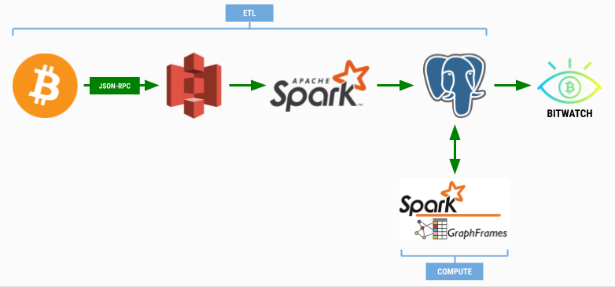

# BitWatch

Enabling cyber forensics on the Bitcoin blockchain by linking addresses used by the same individual and/or entity.

Results can inform criminal investigations into money flows for dark webs (i.e., Silk Road) and fraud detection by tracing network transaction patterns.

Current implementation is for Bitcoin, but solution is highly transferable to other public blockchains (i.e., Ethereum, Bitcoin Cash, Litecoin).

# Table of Contents
1. [Motivation](README.md#Motivation)
2. [Dataset](README.md#Dataset)
3. [Methodology](README.md#Methodology)
4. [Architecture](README.md#Architecture)
5. [Web App](README.md#Web-App)

## Motivation

$350 Billion USD - that number represents the current value of the cryptocurrency market (July-2019).
Despite being highly lucrative, the crypto market is poorly understood.
Specifically, forensics agencies are deeply interested in certain types of transaction behavior such as money laundering, price manipulation, and international remittances.

Bitwatch enables cyber forensics on the Bitcoin blockchain by linking addresses used by the same individual / entity. Results can inform fraud detection and criminal investigations into money flows for dark webs (i.e., Silk Road).

## Dataset

Blockchain data reflects historical Bitcoin blockchain up to block ~570,000 (Jun-2019).

Data was acquired by running a full Bitcoin Core node and deserializing block data into JSON format using JSON-RPC. Detailed instructions for setting up a full node with transaction indexing can be found [here](https://www.buildblockchain.tech/blog/btc-node-developers-guide).

## Methodology

## Architecture

## Web App