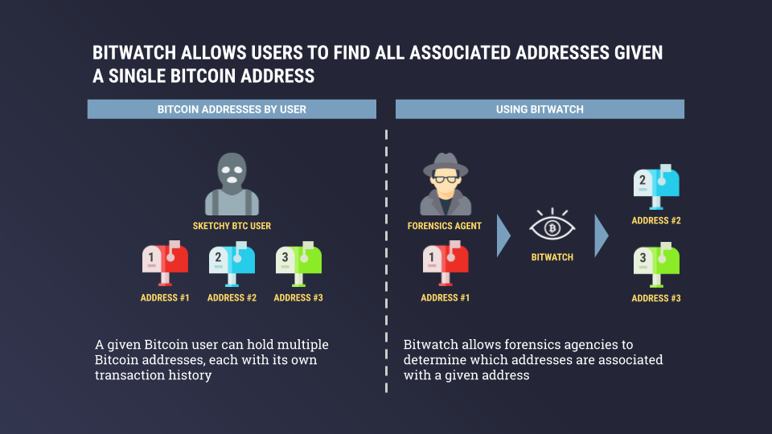
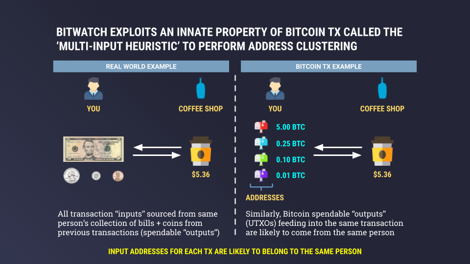
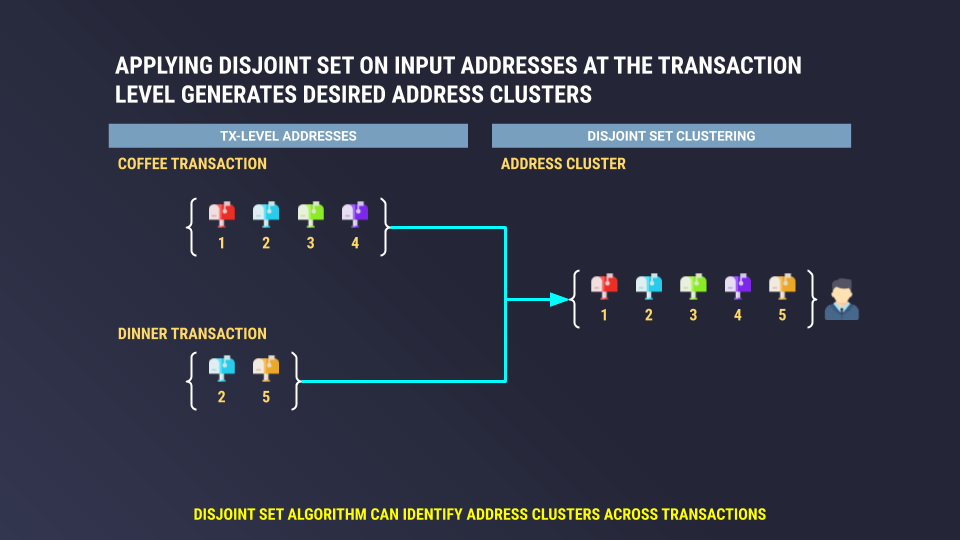
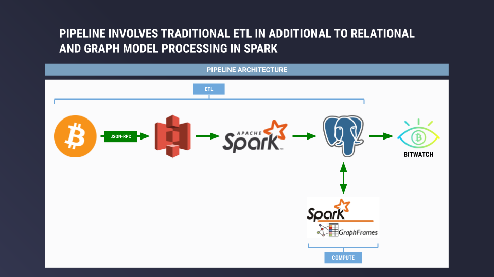

# BitWatch

Enabling cyber forensics on the Bitcoin blockchain by linking addresses used by the same individual and/or entity.

Results can inform criminal investigations into money flows for dark webs (i.e., Silk Road) and fraud detection by tracing network transaction patterns.

Current implementation is for Bitcoin, but solution is highly transferable to other public blockchains (i.e., Ethereum, Bitcoin Cash, Litecoin).

# Table of Contents
1. [Motivation](README.md#Motivation)
2. [Dataset](README.md#Dataset)
3. [Methodology](README.md#Methodology)
4. [Architecture](README.md#Architecture)
5. [Web App](README.md#Web-App)

## Motivation

$350 Billion USD - that number represents the current value of the cryptocurrency market (July-2019).
Despite being highly lucrative, the crypto market is poorly understood.
Specifically, forensics agencies are deeply interested in certain types of transaction behavior such as money laundering, price manipulation, and international remittances.

BitWatch enables cyber forensics on the Bitcoin blockchain by linking addresses used by the same individual / entity. Results can inform fraud detection and criminal investigations into money flows for dark webs (i.e., Silk Road).

## Dataset

Blockchain data reflects the historical Bitcoin blockchain up to block ~580,000 (Jun-2019).

Data was acquired by running a full Bitcoin Core node and deserializing block data (blk*.dat files) into JSON format using JSON-RPC.

Detailed instructions for setting up a full node with transaction indexing can be found [here](https://www.buildblockchain.tech/blog/btc-node-developers-guide).

## Methodology

Bitcoin users can hold multiple addresses - creating a new address is straightforward, low-cost, and nearly instantaneous.
These addresses can then be used throughout a user's transaction history to accumulate and sell Bitcoin.

Assuming a forensics agent (i.e., FBI, CIA) gains access to a single address for a given individual under investigation, BitWatch can return all addresses (address cluster) likely to be associated with that user.

BitWatch exploits an innate property of Bitcoin transactions called the 'multi-input heuristic' to perform address clustering.
For example, let's say you walk into your favorite coffee shop and buy a rather expensive latte for $5.36 USD. You take a five dollar bill, quarter, dime, and penny out of your wallet / coin purse.
In this case we know that all those bills and coins, the 'transaction inputs', came from the same individual - you.
This heuristic can be applied to Bitcoin transactions - all input transactions (UTXOs) are likely to come from the same individual.

Disclaimer: this heuristic does not hold for CoinJoin transactions where groups of individuals can collude and mix inputs into a given transaction.
However, not all Bitcoin wallets support the CoinJoin feature and most users do not commonly use CoinJoin.
In addition, algorithms exist to detect CoinJoin transactions, which may be implemented in a future release.

Fun side note: the privacy implications of the 'multi-input heuristic' have a far-reaching history.
This property was mentioned in the original [Bitcoin whitepaper](https://bitcoin.org/bitcoin.pdf) in Section 10 by Satoshi Nakamoto, the founder of Bitcoin.

Once we have the set of addresses at the individual transaction level, we can apply the classic Disjoint Set (a.k.a. Union Find) graph algorithm to generate address clusters that likely belong to the same individual / entity.
Extending the coffee transaction example from before, we have a set of 4 unique input addresses associated with the coffee transaction.

Now add another transaction called the dinner transaction, which has 2 unique input addresses.
In the diagram below, we can see that address #2 (blue) is present in both the coffee set and the dinner set.
Therefore, we can assume that the same individual holds all five unique addresses.

Applying the Disjoint Set algorithm using a relational style model is not efficient as it requires many self joins.
Instead, we use a graph model with vertices representing unique address IDs and edges representing connections between addresses at the individual transaction level.
We leverage the [connectedComponents()](https://docs.databricks.com/spark/latest/graph-analysis/graphframes/user-guide-scala.html#connected-components) method in Spark Graphframes as an efficient implementation of Disjoint Set.

## Architecture

### Data Acquisition

Data is acquired by running JSON-RPC calls from a full Bitcoin Core node.

Run `./json-rpc-pase-all-blocks.sh` in `/src/bash` directory to deserialize Bitcoin block data into JSON and write into dedicated AWS S3 bucket.
This must be run from a full Bitcoin Core node with transaction indexing enabled (see [here](https://www.buildblockchain.tech/blog/btc-node-developers-guide) for setup instructions)

### Ingestion

BitWatch runs on top of a Spark cluster (one c5.large for master, three c5.2xlarge for workers) and a single PostgreSQL instance (one m4.large).

Data is ingested with Spark from an S3 bucket that holds JSON files (one file for each blockchain block).

Results are then written out to PostgreSQL in a tabular format in a `transactions` table (each row represents one transaction).

Run `process-json.py` in `src/spark` directory using `spark-submit` command in PySpark to ingest JSON files from AWS S3 bucket.

### Compute

BitWatch uses Spark GraphFrames (built on top of a vertex DataFrame and edge DataFrame) to run `.connectedComponents()` method for generating address clusters.

`.connectedComponents()` is an implementation of the Disjoint Set (a.k.a. Union Find) algorithm to cluster addresses across Bitcoin transactions.

Using a graph model for processing transaction data is crucial as Disjoint Set on a relational model is much slower compared to a graph model.

Run `tx-lookup-cluster.py` in `src/spark` directory using `spark-submit` command in PySpark to process `transactions` table in PostgreSQL and generate address clusters.

## Web App

BitWatch has a simple web interface for address cluster lookup based on a single input address.

Website: [BitWatch](https://www.mycelias.com)